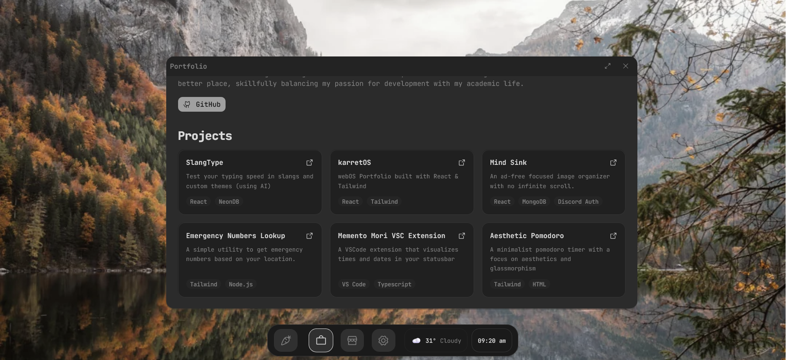
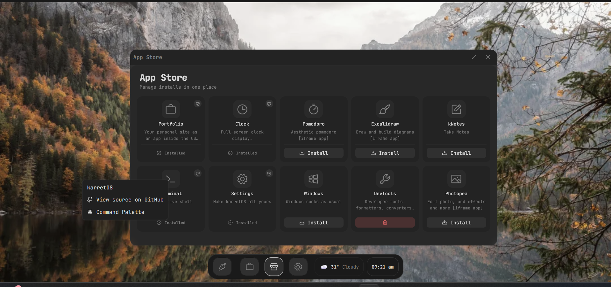

# karretOS

A minimalist, smooth WebOS and portfolio hybrid built for the future.

## Features
- Simplified app registry [literally, just add a folder in `apps/` and update `registery.ts` and `types.ts`
- Pop-up animations, closing, opening window animations
- Desktop widgets with weather, date and time
- Boot screen
- Close, maximise, minimize windows (you can also open multiple windows at once)
- Draggable windows
- Settings app with background, background opacity settings
- Auto-hiding dock with a pin button
  
## Screenshots

